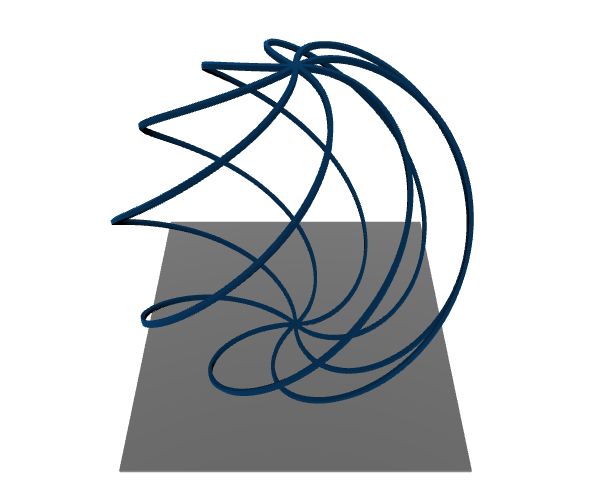

***************
Getting started
***************

.. include:: install.rst

Usage
====================

Microscope settings are defined in `settings.hjson` file and contain information about the microscope and basic slicing settings.

First, we load the structure and the settings:

.. sourcecode:: python

    from f3ast import *
    file_path = 'testing/FunktyBall.stl'

    settings = load_settings()
    struct = Structure.from_file(file_path, **settings["structure"])
    struct.show()

Define the model and build the stream:

.. sourcecode:: python

    gr = 0.15
    k = 1
    sigma = 4.4
    model = DDModel(struct, gr, k, sigma, **settings['dd_model'])
    stream_builder, dwell_solver = StreamBuilder.from_model(model, **settings['stream_builder'])
    dwell_solver.print_total_time()

Save the stream:

.. sourcecode:: python

    save_path = 'test_stream'
    strm = stream_builder.get_stream()
    # saves the stream in microscope readable format
    strm.write(save_path)
    # saves the build parameters for later reference
    save_build(save_path, dwell_solver, stream_builder)

The program saves two files: "test_stream.str" containing the microscope-readable instructions and the "test_stream.pickle" file continaing all the parameters used to build the stream for later reference.

